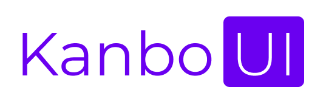
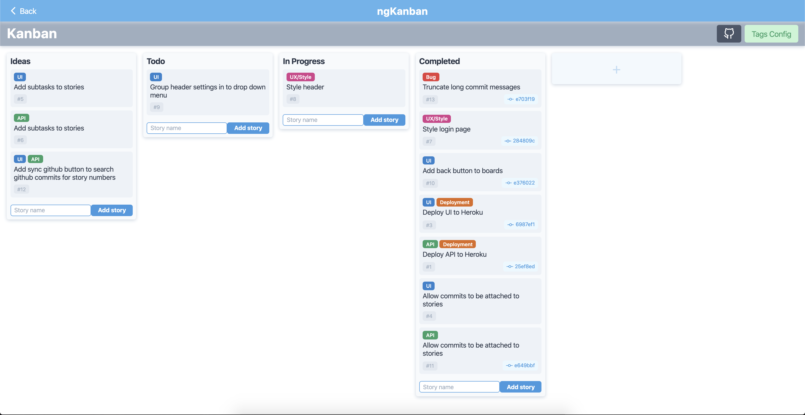
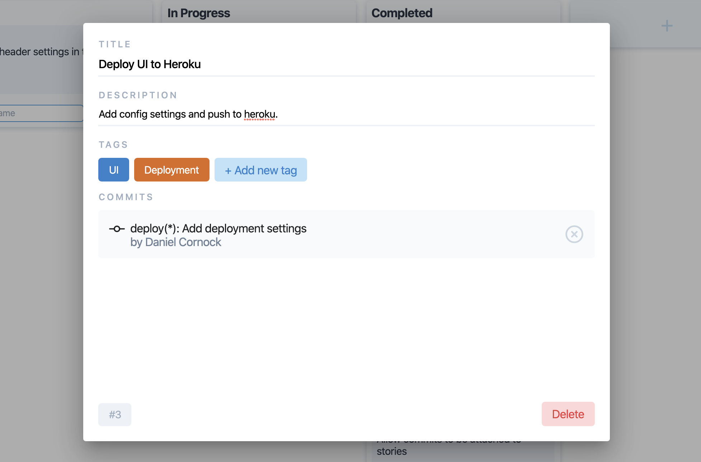
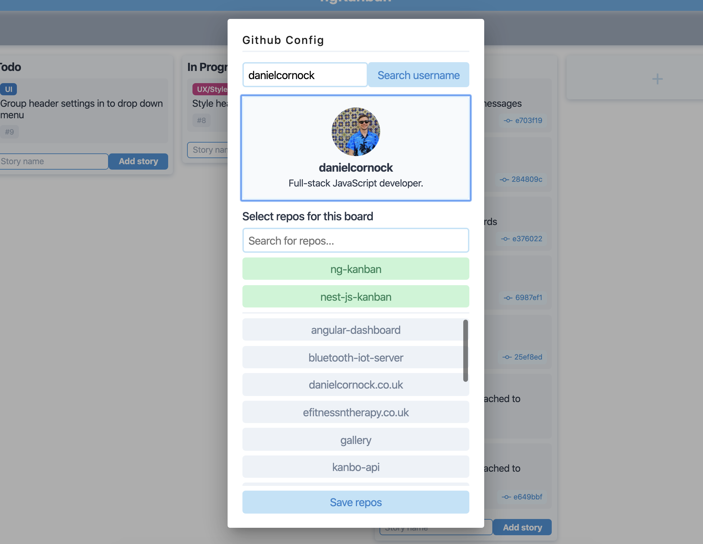

  

  
  
  

<code>Angular</code>
<code>TypeScript</code>
<code>Jasmine</code>
<code>SCSS</code>
<code>TravisCI</code>
<code>Heroku</code>

> This project is a WIP.

Front end for a kanban board application inspired by Trello. View the code for the back-end [here](https://github.com/danielcornock/kanbo-api).

Features include organised columns with drag & drop functionality, linking github commits, tracked story numbers & custom tags & labels.

#### Board view

#### Edit story modal

#### Github config modal

